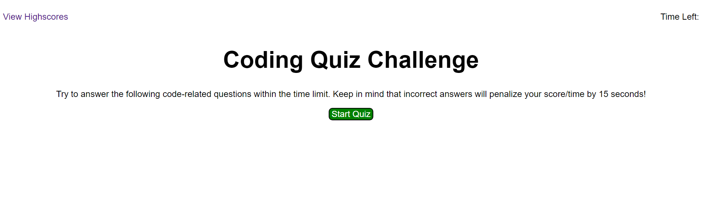

# Coding-Quiz
[Live Link](https://jbrendon15.github.io/Coding-Quiz/)

## Description
For this project we had to recreate a web application that is a timed quiz. We added functions to pull questions from a created array of question objects to display one at a time on the page. We also added event listeners so that all the buttons on the application are working as intended. There are functions in the application that will decrement your time if you answer a question incorrectly and then will display your final score after the quiz is complete. We were able to utilize 'localStorage' so that were able to properly display saved high scores sorted in order from highest score to lowest score. You will also be able to clear all the scores that were saved on the local storage. Creating this project helped me understand the purpose of event listeners so that they will only call a function if a user performs a specific action so that a function will only execute when you want it to.

## Usage

.png)
.png)
